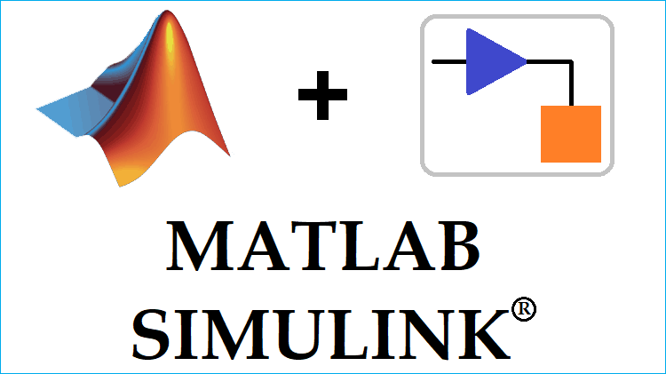
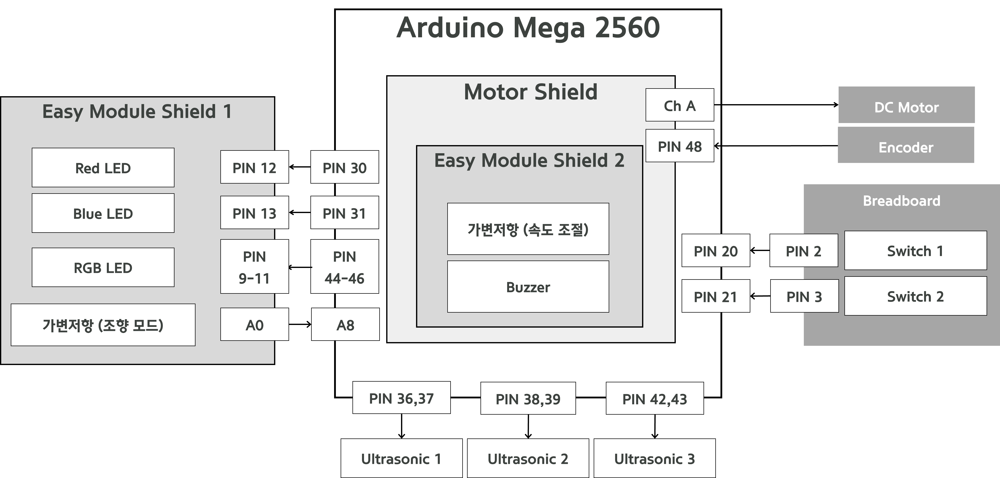
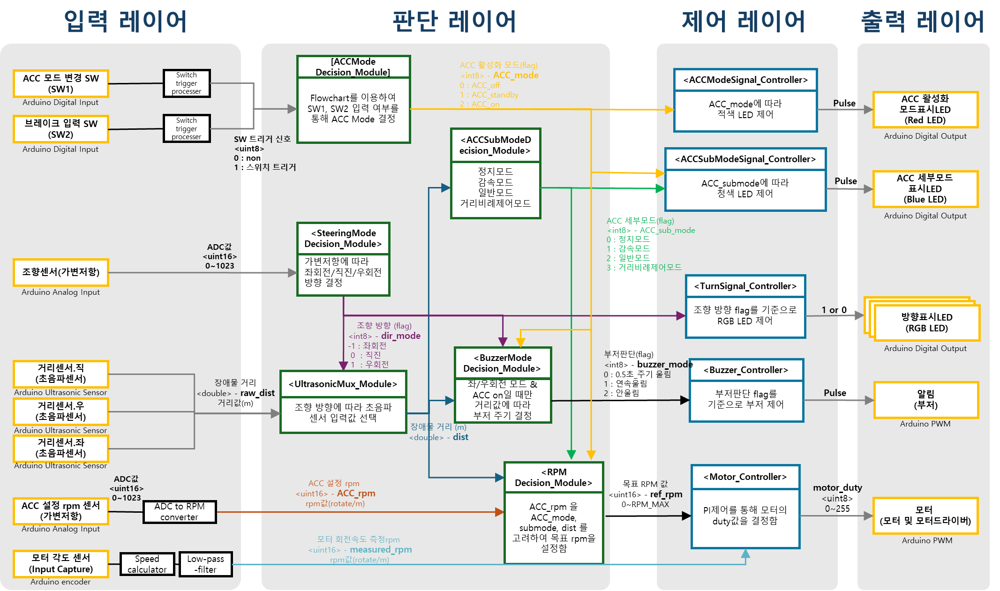

# 목차

1. [📖 프로젝트 소개](#프로젝트-소개)
2. [👥 팀원 구성 및 역할 분담](#팀원-구성-및-역할-분담)
3. [🔧 개발 환경 및 사용 Tool](#개발-환경-및-사용-tool)
4. . [🏛 SW 아키텍쳐](#sw-아키텍쳐)
5. [🏗 HW 아키텍쳐](#hw-아키텍쳐)
6. [🎬 시연 영상](#시연-영상)
7.  [🛠 트러블 슈팅](#트러블-슈팅)


# 프로젝트 소개
> **고객 맞춤 지능형 차량 반응 제어 시스템 개발**

* 개발 기간: 2024-04-22 ~ 2024-04-30

## 프로젝트 목적
* **V-cycle 개발 프로세스** 상세 적용 및 산출물 관리
  * OEM의 요구사항 만족을 위해 V-Cycle 프로세스 기반으로 프로세스와 제품의 품질을 모두 높임
  * Requirement Toolbox 를 활용하여 추적성을 확보하고, 요구사항을 관리
  * 단위/통합/시스템 테스트 단계에서 재테스트 및 회귀 전략 수립 후 수행
* **모델 기반 설계(Model-Based Design)** 를 활용하여 개발 수행 
  * 모델과 제어기를 Simulink Block으로 개발 및 검증 수행(SILS)
  * SILS 이후, 순차적 하드웨어 부품 적용하여 실행 및 검증 수행(HILS)
* **PID 제어**
  * PI Gain 튜닝을 통해 시스템 성능 분석을 수행하고 최적의 제어 Gain값을 도출

## 프로젝트 요구사항 

RQ-01 ~ RQ-10 은 기본 요구사항이며, RQ-11 ~ RQ-18은 추가 요구사항이다.

|Req ID |	summary | 
|:-----|:----------|
|RQ-01	|ACC 모드는 3단계로 구성된다(ACC off, ACC standby, ACC on) |
|RQ-02	|"SW1을 누르면 다름 순서로 모드가 변경된다. (ACC off-> ACC standby -> ACC on -> ACC off) " |
|RQ-03	|ACC off 는 적색 LED가 1초 주기로 ACC standby는 적색 LED가 0.2초 주기로 깜빡이며 ACC On은 적색 LED가 항상 켜져 있다. |
|RQ-04	|SW2를 누르면 언제든지 ACC off 상태로 모드가 변경된다.  |
|RQ-05	|ACC on 상태와 ACC standby 상태에서만 모터가 구동될 수 있다. ACC off 상태에서 모터는 멈춘다. |
|RQ-06	|ACC on 상태에서는 가변저항을 통해 속도 조절이 가능하지만, ACC standby 상태에서는 가변저항을 바꾸어도 속도가 조절되지 않는다.  |
|RQ-07	|ACC on 상태와 ACC stanby 상태에서 초음파 센서를 통해 50cm 이내 장애물이 있을 경우, 모터의 현재 속도 대비 50%로 감속한다. |
|RQ-08	|적색 LED가 아닌 청색 LED를 0.2초 주기로 깜박여 감속 모드임을 나타낸다.  |
|RQ-09	|ACC on 상태와 ACC stanby 상태에서 초음파 센서를 통해 10cm 이내 장애물이 있는 경우, 모터의 브레이크를 통해 정지한다. |
|RQ-10	|적색 LED가 아닌 청색 LED를 항상 켜져 있게 하여 정지 모드임을 나타낸다.  |
|RQ-11	|ACC on 상태이고, 선행 차량과의 거리가 50cm이상, 100cm이하 일 때, 거리 비례 제어 기능을 수행한다. |
|RQ-12	|차량이 100cm 이내에 있을 때는 ACC 설정 rpm를 재설정하지 못하게 한다. |
|RQ-13	|거리 비례 제어 기능을 수행할 때, 목표 rpm은 거리(m) * ACC 설정 rpm이다. |
|RQ-14	|선행 차량이 감지되지 않거나, 선행 차량과의 거리가 100cm보다 크면, 사용자가 지정한 ACC 설정 rpm로 모터를 구동한다. |
|RQ-15	|ACC on 상태와 ACC standby 상태에서 가변저항 값을 10ms 주기로 읽어오며, 가변저항 지점값이 0 ~ 1/3 범위이면 좌회전, 1/3 ~ 2/3 범위이면 직진, 2/3 ~ 1 범위이면 우회전으로 결정한다. (가변저항의 deadzone이 없음을 전제) |
|RQ-16	|차량의 주행 방향에 해당하는 초음파 센서의 값을 읽어온다. |
|RQ-17	|좌회전 혹은 우회전을 할 때, 차량 혹은 장애물이 감지되면 왼쪽 혹은 오른쪽 방향의 초음파 센서로 측정한 장애물 거리가 50cm 이내면 0.5초 주기 부저 알림, 10cm 이내면 연속적인 부저 알림을 수행한다.(주파수는 상관없음) |
|RQ-18	|좌회전일 경우 빨간색 LED를 0.5초 주기로 점등, 우회전일 경우 파란색 LED를 0.5초 주기로 점등, 직진일 경우 초록색 LED를 항상 켜놓는다. (LED는 RGB LED를 사용한다) |

## 프로젝트 기능
* **Adaptive Cruise Control**
  * ACC 기능이 on 상태이면, 가변저항을 통해 속도 조절이 가능하다.
  * 선행 차량과의 거리가 50cm 이하일 경우, 현재 속도의 50%로 감속하여 청색 LED가 0.2초 주기로 깜박이며 사용자에게 감속 중임을 알린다. 
  * 선행 차량과의 거리가 10cm 이하일 경우, 모터는 정지하며 청색 LED가 항상 켜져 사용자에게 모터 정지를 알린다. 


* **<span style="background-color:#CCE5FF">DR(Distance Responsive) Mode </span>**
  * ACC가 on 상태이며, 선행 차량과의 거리가 50cm이상, 100cm이내일 때 거리 DR모드를 수행한다. 
  * 거리 비례 제어 기능이란, 거리값이 줄어듬에 따라 차량의 속도가 비례하게 감속하는 기능이다. 
  * 거리 비례 제어 기능 수행 시 목표 rpm값은 [거리(m) * ACC 설정 rpm]이 된다. 


* **<span style="background-color:#DCFFE4"> Steering Mode </span>**   
  * 가변저항 값에 따른 조향모드 판단을 수행한다. 
  * 조향모드에 따라 초음파 센서 3개 중 1개를 선택하고 거리값을 읽어온다.
  * 조향모드에 따라 RGB LED를 점등한다. 
  * 좌회전 및 우회전일 때 50cm 이하 거리에 장애물이 감지되면 사용자에게 부저를 통해 알린다.

# 팀원 구성 및 역할 분담
<table>
 <tr>
    <td align="center"><a href="https://github.com/re-ag"></a></td>
    <td align="center"><a href="https://github.com/shintaewon"></a></td>
    <td align="center"><a href="https://github.com/GeoChoi"></a></td>
   <td align="center"></a></td>
   <td align="center"></td>
  </tr>
  <tr>
    <td align="center"><a href="https://github.com/re-ag"><b>김재은</b></a></td>
    <td align="center"><a href="https://github.com/shintaewon"><b>신태원<br>(팀장)</b></a></td>
    <td align="center"><a href="https://github.com/GeoChoi"><b>최지오</b></a></td>
    <td align="center"><a href="https://github.com/chanik-s"><b>정찬익</b></a></td>
    <td align="center"><a href="https://github.com/howonu"><b>유호원</b></a></td>
  </tr>
   <tr>
    <td align="left"> - 하드웨어 아키텍처 설계<br>- 판단 레이어 모듈 개발<br>- 제어 레이어 모듈 개발<br>- 단위/통합 테스트<br></td>
    <td align="left">- 시스템 아키텍처 설계<br>- 일정 및 형상 관리<br> - 제어 레이어 모듈 개발<br>- 단위/통합/시스템 테스트</td>
    <td align="left">- 소프트웨어 아키텍처 설계 <br>- 판단 레이어 모듈 개발 <br>- 제어 레이어 모듈 개발<br>- 단위/통합/시스템 테스트</td>
    <td align="left">- 소프트웨어 아키텍처 설계 <br>- 입력 레이어 모듈 개발 <br>- 판단 레이어 모듈 개발<br>- 단위/통합 테스트</td>
    <td align="left">- 하드웨어 아키텍처 설계 <br>- 판단 레이어 모듈 개발 <br>- 제어 레이어 모듈 개발<br>- 단위/통합 테스트</td>
  </tr>
</table>

# 개발 환경 및 사용 Tool
<table>
 <tr>
    <td align="center">Confluence </td>
    <td align="center"></a></td>
  </tr>
  <tr>
    <td align="center">Jira </td>
    <td align="center"></a></td>
  </tr>
  <tr>
    <td align="center">Github </td>
    <td align="center"></a></td>
  </tr>
  <tr>
    <td align="center">Matlab/Simulink </td>
    <td align="center"></a></td>
  </tr>
</table>

# HW 아키텍쳐


# SW 아키텍쳐


# 시연 영상

# 트러블 슈팅
## 모듈 통합 시, 프로그램이 비이상적으로 종료되는 문제
```
External Mode Open Protocol CheckData command failed
Caused by:
Multiple errors detected. 
• XCP internal error: timeout expired, in response to XCP SYNCH command 
• Error detected while trying to disconnect Simulink from target application. 
   XCP error: XCP internal error: No server connected
```

 에러 메시지를 통해 XCP 프로토콜 사용에 문제가 있음을 파악하고, 모델 내 "하드웨어 구현 - Target Hardware resources - External mode - Communication Interface" 의 **XCP on Serial** 방식에서 **Serial 방식**으로 변환하여 해결하였다.


## :white_check_mark: Jira Smart Commit 규칙
- '완료' 로 상태 바꾸기 : #{ISSUE_NUM} #done #comment "{detail info}"
- '진행 중' 으로 상태 바꾸기 : #{ISSUE_NUM} #in-progress #comment "{detail info}"
- ISSUE_NUM - PROJ_N (Jira 에 해당 티켓에 대한 Number 쓰면됨)
- detail info - 해당 커밋이 어떤 내용인지 적으면됨,.
- ex) PROJ_4 #done #comment feat: 조도 센서 데이터 받아오는거까지 완료 

## :white_check_mark: 커밋 메시지 규칙

- `feat` : 새로운 기능에 대한 커밋
- `fix` : 빌드 관련 파일 수정에 대한 커밋
- `build` : 빌드 관련 파일 수정에 대한 커밋
- `chore` : 그 외 자잘한 수정에 대한 커밋(기타 변경)
- `ci` : CI 관련 설정 수정에 대한 커밋
- `docs` : 문서 수정에 대한 커밋
- `style` : 코드 스타일 혹은 포맷 등에 관한 커밋
- `refactor` : 코드 리팩토링에 대한 커밋
- `test` : 테스트 코드 수정에 대한 커밋
- `init` : 시스템 초기 설정
- `dir` : 폴더 및 문서 구조 변경
### 커밋 메시지 예시
`#1 feat: 조도센서 관련 기능 구현`

## :white_check_mark: 깃허브 이슈 사용 관련
- 개발 시작 전 **이슈** & 브랜치 생성 후 작업합니다.
- 이슈 만들어서 Number 확인하고, 커밋할때 앞에다가 #이슈번호 붙혀서 커밋하기!!
- 브랜치도 이슈 Number 따라서 만들기( ex. feature/7 )

## :white_check_mark: 기타 규칙
- `goto` 문 사용하지 않기
- 포인터 사용하지 않기 
